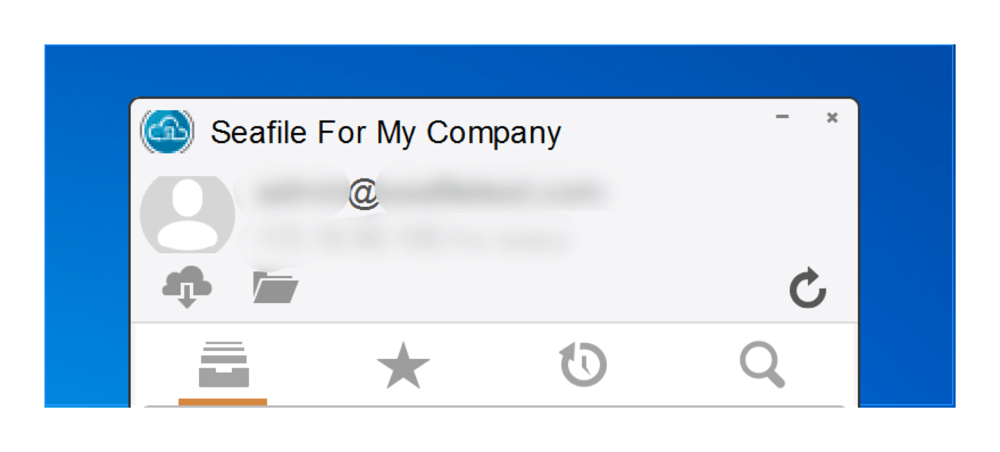

# Seafile 桌面定制

## 定制 Seafile 桌面客户端上显示的徽标和名称(仅限 Seafile 专业版)

注意：该功能仅在Seafile桌面客户端4.4.0及更高版本中可用。
默认情况下，文字“Seafile”显示在seafile桌面客户端窗口的顶部，并附有 Seafile 标识。要自定义它们，请设置 `DESKTOP_CUSTOM_LOGO` 和 `DESKTOP_CUSTOM_BRAND` 到 `seahub_settings.py`。



图片尺寸必须是 `24x24`，通常你应该把它放在 `custom` 目录中；请按照以下方式创建 custom 目录：
创建 ``<seafile-install-path>/seahub-data/custom`` 目录. 在 `seafile-server-latest/seahub/media` 目录下创建一个符号链接： `ln -s ../../../seahub-data/custom custom`.
升级过程中，Seafile 升级脚本会自动创建符号链接以维持个性化设置。

在 `seahub_settings.py` 中添加以下配置信息：

```python
DESKTOP_CUSTOM_LOGO = 'custom/desktop-custom-logo.png'
DESKTOP_CUSTOM_BRAND = 'Seafile For My Company'
```

重启服务以生效。

## 在所有Windows PC上自动安装Seafile Client

您可以在Windows域控制器中设置组策略对象(GPO)，以在公司网络中的所有Windows PC上自动安装Seafile客户端。Seafile客户端作为MSI安装程序提供。所以你只需要遵循[Microsoft文档](https://support.microsoft.com/en-us/kb/816102)中的说明来自动安装客户端。

## 为所有Windows PC预配置Seafile客户端

Seafile客户端的一些行为可以通过Windows上的注册表项进行配置。因此，可以通过组策略对象（GPO）以集中的方式控制客户端的行为。

[本文档](https://github.com/haiwen/seafile-user-manual/blob/master/en/faq.md)中介绍了用于配置Seafile客户端的注册表项。要设置GPO以在Windows上设置这些注册表项，请参阅[Microsoft文档](https://technet.microsoft.com/en-us/library/cc753092.aspx)。