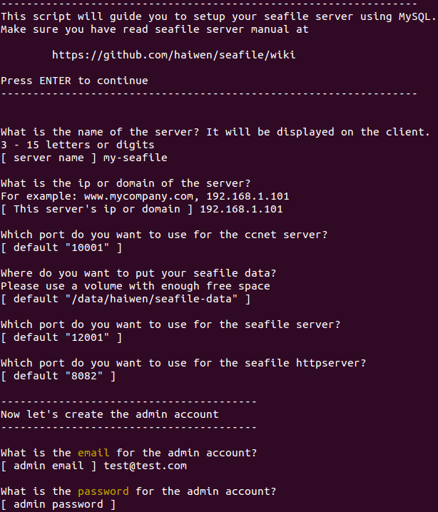
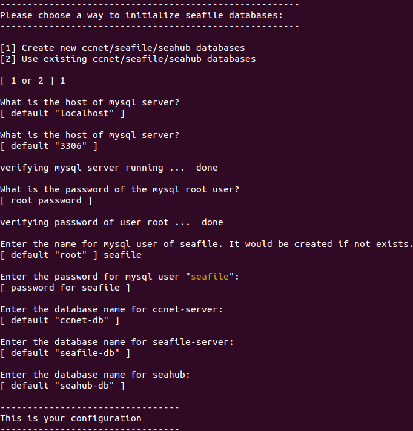
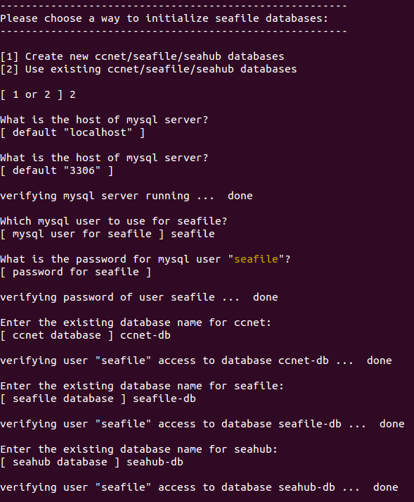
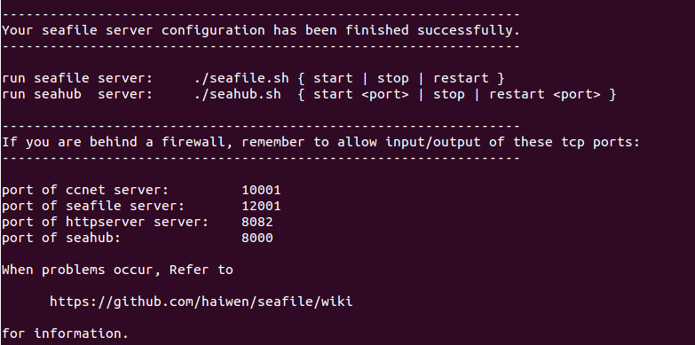

# 部署 Seafile 服务器（使用 MySQL）

此文档用来说明通过预编译好的安装包，来安装并运行基于 MySQL 的 Seafile
服务器.

下载
----

到[下载页面](http://www.seafile.com/download)下载最新的服务器安装包.

部署和目录设计
--------------

假设你公司的名称为 **haiwen**,你也已经下载 seafile-server\_1.4.0\_\* 到你的
**home** 目录下。 我们建议这样的目录结构:

    mkdir haiwen
    mv seafile-server_* haiwen
    cd haiwen
    #将 seafile-server_* 移动到 haiwen 目录下后
    tar -xzf seafile-server_*
    mkdir installed
    mv seafile-server_* installed

现在，你的目录看起来应该像这样：

    #tree haiwen -L 2
    haiwen
    ├── installed
    │   └── seafile-server_1.8.2_x86-64.tar.gz
    └── seafile-server-1.8.2
        ├── reset-admin.sh
        ├── runtime
        ├── seafile
        ├── seafile.sh
        ├── seahub
        ├── seahub.sh
        ├── setup-seafile.sh
        └── upgrade

**这样设计目录的好处在于**

-   和 seafile 相关的配置文件都可以放在 **haiwen** 目录下，便于集中管理.
-   后续升级时,你只需要解压最新的安装包到 **haiwen** 目录下.

*这样你可以重用 **haiwen** 目录下已经存在的配置文件，而不用重新配置*.

准备 MySQL 数据库
-----------------

Seafile 服务器有三个组件需要拥有自己的数据库:

-   ccnet server
-   seafile server
-   seahub

Seafile 服务器组件更多信息请看[[Seafile服务器组件概览]].

有两种方法可以初始化数据库:

1.  通过`setup-seafile-mysql.sh`脚本创建数据库.
2.  自己或其他人(比如数据库管理员)创建

我们建议采用第一种方法. 脚本会要求你提供 MySQL
数据库的的根密码，之后创建:

-   ccnet/seafile/seahub 数据库
-   一个可以连接到这些数据库的用户

然而，有时你不得不使用第二种方法.
如果你没有根密码,你需要通过拥有这种权限的人（比如数据库管理员）来帮助你创建三个数据库，和一个能连接这三个数据库的用户.
例如，为 ccnet/seafile/seahub 分别创建如下三个数据库: `ccnet-db` /
`seafile-db` / `seahub-db`, 和一个可以连接这三个数据库的 MySQL
用户`seafile`:

    create database `ccnet-db` character set = 'utf8';
    create database `seafile-db` character set = 'utf8';
    create database `seahub-db` character set = 'utf8';

    create user 'seafile'@'localhost' identified by 'seafile';

    GRANT ALL PRIVILEGES ON `ccnet-db`.* to `seafile`;
    GRANT ALL PRIVILEGES ON `seafile-db`.* to `seafile`;
    GRANT ALL PRIVILEGES ON `seahub-db`.* to `seafile`;

安装 Seafile 服务器
-------------------

### 安装前的准备工作

安装 Seafile 服务器之前，请确认已安装以下软件

-   python 2.7
-   python-setuptools
-   python-imaging
-   python-mysqldb

<!-- -->

    #在Debian/Ubuntu系统下
    apt-get update
    apt-get install python2.7 python-setuptools python-imaging python-mysqldb

### 安装

    cd seafile-server-*
    ./setup-seafile-mysql.sh  #运行安装脚本并回答预设问题

如果你的系统中没有安装上面的某个软件，那么 Seafile初始化脚本会提醒你安装相应的软件包.

该脚本会依次询问你一些问题，从而一步步引导你配置 Seafile 的各项参数

<table>
<tr>
<th>参数</th>
<th>作用</th>
<th>说明</th>
</tr>
<tbody>
<tr class="odd">
<td align="left">
seafile server name
</td>
<td align="left">
seafile 服务器的名字，将来在客户端会显示为这个名字
</td>
<td align="left">
3 ~ 15 个字符，可以用英文字母，数字，下划线
</td>
</tr>
<tr class="even">
<td align="left">
seafile server ip or domain
</td>
<td align="left">
seafile 服务器的 IP 地址或者域名
</td>
<td align="left">
客户端将通过这个 IP 或者地址来访问你的 Seafile 服务
</td>
</tr>
<tr class="odd">
<td align="left">
ccnet server port
</td>
<td align="left">
ccnet 使用的 TCP 端口
</td>
<td align="left">
一般使用默认的10001 端口，如果已经被占用，可以设置为其他的端口
</td>
</tr>
<tr class="even">
<td align="left">
seafile data dir
</td>
<td align="left">
seafile 数据存放的目录，用上面的例子，默认将是 /data/haiwen/seafile-data
</td>
<td align="left">
seafile 数据将随着使用而逐渐增加，请把它放在一个有足够大空闲空间的分区上
</td>
</tr>
<tr class="odd">
<td align="left">
seafile server port
</td>
<td align="left">
seafile 服务器 使用的 TCP 端口
</td>
<td align="left">
一般使用默认的 12001 端口，如果已经被占用，可以设置为其他的端口
</td>
</tr>
<tr class="even">
<td align="left">
seafile fileserver port
</td>
<td align="left">
seafile fileserver 使用的 TCP 端口
</td>
<td align="left">
一般使用默认的 8082 端口，如果已经被占用，可以设置为其他的端口
</td>
</tr>
<tr class="odd">
<td align="left">
seahub admin email
</td>
<td align="left">
sehaub管理员的登录帐户名
</td>
<td align="left">
使用一个 email 地址
</td>
</tr>
<tr class="even">
<td align="left">
seahub admin password
</td>
<td align="left">
seahub 管理员的密码
</td>
<td align="left"></td>
</tr>
<tr class="odd">
</tr>
</tbody>
</table>

在这里, 你会被要求选择一种创建 Seafile 数据库的方式:

    -------------------------------------------------------
    Please choose a way to initialize seafile databases:
    -------------------------------------------------------

    [1] Create new ccnet/seafile/seahub databases
    [2] Use existing ccnet/seafile/seahub databases

具体选择哪项, 取决于你是否拥有根密码.

-   如果选择`1`, 你需要提供根密码. 脚本程序会创建数据库和用户。
-   如果选择`2`, ccnet/seafile/seahub
    数据库应该已经被你（或者其他人）提前创建。

如果选择 `[1] Create new ccnet/seafile/seahub databases`,你会被问三个问题:

<table>
<tr>
<th>Question</th>
<th>Description</th>
<th>Note</th>
</tr>
<tbody>
<tr class="odd">
<td align="left">
mysql server host
</td>
<td align="left">
the host address of the mysql server
</td>
<td align="left">
the default is localhost
</td>
</tr>
<tr class="even">
<td align="left">
mysql server port
</td>
<td align="left">
the port of the mysql server
</td>
<td align="left">
the default is 3306. Almost every mysql server uses this port.
</td>
</tr>
<tr class="odd">
<td align="left">
root password
</td>
<td align="left">
the password of mysql root account
</td>
<td align="left">
the root password is required to create new databases and a new user
</td>
</tr>
<tr class="even">
<td align="left">
mysql user for seafile
</td>
<td align="left">
the username for seafile programs to use to access MySQL server
</td>
<td align="left">
if the user does not exist, it would be created
</td>
</tr>
<tr class="odd">
<td align="left">
password for seafile mysql user
</td>
<td align="left">
the password for the user above
</td>
<td align="left"></td>
</tr>
<tr class="even">
<td align="left">
ccnet dabase name
</td>
<td align="left">
the name of the database used by ccnet, default is &quot;ccnet-db&quot;
</td>
<td align="left">
the database would be created if not existing
</td>
</tr>
<tr class="odd">
<td align="left">
seafile dabase name
</td>
<td align="left">
the name of the database used by seafile, default is &quot;seafile-db&quot;
</td>
<td align="left">
the database would be created if not existing
</td>
</tr>
<tr class="even">
<td align="left">
seahub dabase name
</td>
<td align="left">
the name of the database used by seahub, default is &quot;seahub-db&quot;
</td>
<td align="left">
the database would be created if not existing
</td>
</tr>
</tbody>
</table>

如果你选择`[2] Use existing ccnet/seafile/seahub databases`,
你会被问到如下三个问题:

<table>
<tr>
<th>Question</th>
<th>Description</th>
<th>Note</th>
</tr>
<tbody>
<tr class="odd">
<td align="left">
mysql server host
</td>
<td align="left">
the host address of the mysql server
</td>
<td align="left">
the default is localhost
</td>
</tr>
<tr class="even">
<td align="left">
mysql server port
</td>
<td align="left">
the port of the mysql server
</td>
<td align="left">
the default is 3306. Almost every mysql server uses this port
</td>
</tr>
<tr class="odd">
<td align="left">
mysql user for seafile
</td>
<td align="left">
the user for seafile programs to use to access MySQL server
</td>
<td align="left">
the user must already exists
</td>
</tr>
<tr class="even">
<td align="left">
password for seafile mysql user
</td>
<td align="left">
the password for the user above
</td>
<td align="left"></td>
</tr>
<tr class="odd">
<td align="left">
ccnet dabase name
</td>
<td align="left">
the name of the database used by ccnet
</td>
<td align="left">
this database must already exist
</td>
</tr>
<tr class="even">
<td align="left">
seafile dabase name
</td>
<td align="left">
the name of the database used by seafile, default is &quot;seafile-db&quot;
</td>
<td align="left">
this database must already exist
</td>
</tr>
<tr class="odd">
<td align="left">
seahub dabase name
</td>
<td align="left">
the name of the database used by seahub, default is &quot;seahub-db&quot;
</td>
<td align="left">
this database must already exist
</td>
</tr>
</tbody>
</table>

如果安装正确完成，你会看到下面这样的输出

现在你的目录结构看起来应该是这样:

    #tree haiwen -L 2
    haiwen
    ├── ccnet               # configuration files
    │   ├── ccnet.conf
    │   ├── mykey.peer
    │   ├── PeerMgr
    │   └── seafile.ini
    ├── installed
    │   └── seafile-server_1.8.2_x86-64.tar.gz
    ├── seafile-data
    │   └── seafile.conf
    ├── seafile-server-1.8.2  # active version
    │   ├── reset-admin.sh
    │   ├── runtime
    │   ├── seafile
    │   ├── seafile.sh
    │   ├── seahub
    │   ├── seahub.sh
    │   ├── setup-seafile.sh
    │   └── upgrade
    ├── seafile-server-latest  # symbolic link to seafile-server-1.8.2
    ├── seahub-data
    │   └── avatars
    ├── seahub_settings.py   # optional config file
    └── seahub_settings.pyc

`seafile-server-latest`文件夹为指向当前 Seafile 服务器文件夹的符号链接.
将来你升级到新版本后, 升级脚本会自动更新使其始终指向最新的 Seafile
服务器文件夹..

启动 Seafile 服务器
-------------------

### 启动之前

因为 Seafile 在客户端和服务器之间使用持续连接，如果你的客户端**数量巨大**, 你应该在启动 Seafile 之前修改你的 Linux 文件最大打开数，如下:

    ulimit -n 30000

### 启动 Seafile 服务器和 Seahub 网站

在 seafile-server-1.8.2 目录下，运行如下命令

-   启动 Seafile:

<!-- -->

    ./seafile.sh start # 启动 Seafile 服务

-   启动 Seahub

<!-- -->

    ./seahub.sh start <port>  # 启动 Seahub 网站 （默认运行在8000端口上）

**小贴士:** 你第一次启动 seahub 时，`seahub.sh` 脚本会提示你创建一个 seafile 管理员帐号。

服务启动后, 打开浏览器并输入以下地址

    http://192.168.1.111:8000/

你会被重定向到登陆页面. 输入你在安装 Seafile 时提供的用户名和密码后，你会进入 Myhome 页面，新建资料库.

**恭喜!** 现在你已经成功的安装了 Seafile 服务器.

#### 在另一端口上运行 Seahub

如果你不想在默认的 8000 端口上运行 Seahub, 而是想自定义端口（比如8001）中运行，请按以下步骤操作:

-   关闭 Seafile 服务器

<!-- -->

    ./seahub.sh stop # 停止 Seafile 进程
    ./seafile.sh stop # 停止 Seahub

-   更改`haiwen/ccnet/ccnet.conf`文件中`SERVICE_URL` 的值(假设你的 ip
    或者域名时`192.168.1.100`), 如下:

<!-- -->

    SERVICE_URL = http://192.168.1.100:8001

-   重启 Seafile 服务器

<!-- -->

    ./seafile.sh start # 启动 Seafile 服务
    ./seahub.sh start 8001 # 启动 Seahub 网站 （运行在8001端口上）

`ccnet.conf`更多细节请看(server_configuration.md) .

关闭/重启 Seafile 和 Seahub
---------------------------

#### 关闭

    ./seahub.sh stop # 停止 Seahub
    ./seafile.sh stop # 停止 Seafile 进程

#### 重启

    ./seafile.sh restart # 停止当前的 Seafile 进程，然后重启 Seafile
    ./seahub.sh restart  # 停止当前的 Seahub 进程，并在 8000 端口重新启动 Seahub

#### 如果停止/重启的脚本运行失败

大多数情况下 seafile.sh seahub.sh 脚本可以正常工作。如果遇到问题：

-   使用**pgrep**命令检查 seafile/seahub 进程是否还在运行中

<!-- -->

    pgrep -f seafile-controller # 查看 Seafile 进程
    pgrep -f "manage.py run_gunicorn" # 查看 Seahub 进程

-   使用**pkill**命令杀掉相关进程

<!-- -->

    pkill -f seafile-controller # 结束 Seafile 进程
    pkill -f "manage.py run_gunicorn" # 结束 Seafile 进程

OK!
---

查看seafile更多信息请移至..

* [Nginx 下配置 Seahub](deploy_with_nginx.md) / [Apache 下配置 Seahub](deploy_with_apache.md)
* [Nginx 下启用 Https](https_with_nginx.md) / [Apache 下启用 Https](https_with_apache.md)
* [Seafile LDAP配置](using_ldap.md)
* [管理员手册](../maintain/README.md)

