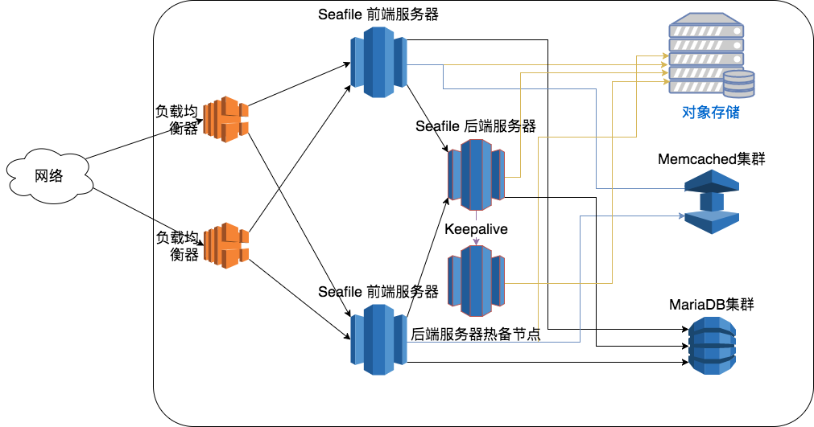
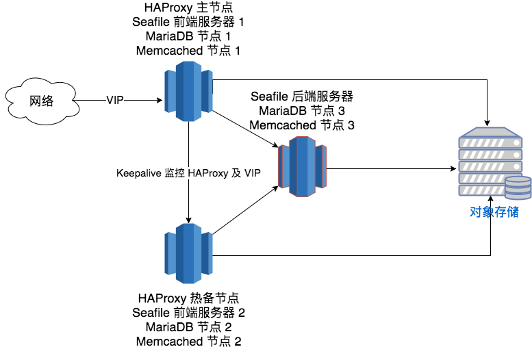

# 可扩展高可用 Seafile 集群

本文档提供一个可扩展、高可用的 Seafile 集群架构。这种架构主要是面向较大规模的集群环境，可以通过增加更多的服务器来提升服务性能。如果您只需要高可用特性，请参考[3节点高可用集群文档](ha_cluster.md)。

## <a id="wiki-arch"></a> 架构

Seafile集群方案采用了3层架构：

* 负载均衡层：将接入的流量分配到 seafile 服务器上。并且可以通过部署多个负载均衡器来实现高可用。
* Seafile 服务器集群：一组 seafile 服务器实例。如果集群中的某个实例不可用，负载均衡调度器将停止向其传输流量，以实现高可用。
* 后端存储、数据库、缓存

该架构支持横向扩展。这意味着，您可以通过添加更多的 Seafile 服务器来分担处理流量，架构图如下：



负载均衡器可以使用硬件负载均衡器或者 HAProxy 这种软件负载均衡器。当使用 HAProxy 作为负载均衡器时，可以采用主从热备的架构。客户端通过一个虚拟IP地址（VIP）来访问 Seafile 服务。该 VIP 平时绑定在 HAProxy 主节点上。主从节点之间通过 [Keepalived](http://www.keepalived.org/) 来进行可用性监控，当从节点检测到主节点不可用时，主动将 VIP 接管过来。对客户端来说，这个切换是不可感知的。

Seafile 服务器集群中的服务器分为两类角色：前端服务器节点和后端服务器节点。前端服务器直接为客户端提供文件访问的服务，包括网页、移动端和文件同步访问。后端服务器节点负责运行一些后台任务，包括文件全文检索、Office文件预览生成器、AD 用户信息同步等。一个集群中可以有任意多个的前端服务器节点，可根据性能需求进行扩展。而后端服务器节点只有一个，不过由于其运行的是后台任务，不可用并不会影响主要的文件访问功能，所以可以不配置高可用。如果需要为后端节点实现高可用，可以通过主从热备的方式，用 Keepalived 来实现主后端节点不可用时，自动切换到从节点。

Seafile 前端服务器节点上有两个主要组件：web 服务(Nginx/Apache)和 Seafile 应用程序服务。web 服务将请求从客户端传递到 seafile 应用程序服务。Seafile 服务器独立工作，它们不知道对方的状态。这意味着集群中某个服务器发生故障不会影响到其他服务器实例。负载均衡服务器负责检测故障和重新分发请求。

即便 Seafile 服务器是独立工作的，它们也必须共享一些会话信息。所有共享的会话信息被保存在 memcached 服务上。因此，所有的 Seafile 服务器必须连接到相同的 memcached 服务器（集群）。

所有的 Seafile 服务器都访问相同的用户数据。这些用户数据包括两部分：一部分存储在 MariaDB 数据库中，另一部分存储在后端分布式存储集群中 (S3, Ceph etc.)。所有的应用程序服务器都向客户提供同样的数据。所有的应用服务器都必须能够连接到相同的数据库或相同的数据库集群。

从整个服务的高可用性上考虑，我们建议把 MariaDB 和 Memcached 都配置成集群模式，并且 MariaDB 和 Memcached 可以部署在相同的服务器上，以节省硬件资源。具体的配置方式可参考[这个文档](mariadb_memcached_cluster.md)。

上述的集群架构是针对相对大型的集群而设计的，集群中各个部件一般都运行在独立的服务器上。按照上述的架构，我们需要的服务器资源为：

* 负载均衡：2台服务器
* Seafile 前端服务器集群：至少2台服务器
* Seafile 后端服务器：1台服务器，如果配置高可用需要2台服务器
* Memcached + MariaDB 集群：3台服务器
* 文件存储：取决于使用的存储后端类型，如果使用分布式存储，也需要多台服务器构成集群

有时为了节约硬件资源，我们可以把多个部件部署在一个服务器上。我们可以利用最少3台服务器来实现 Seafile 集群。架构图如下：



上述3节点的架构中，我们把负载均衡和 Seafile 前端服务器共享到两台服务器上，第三台服务器作为后端服务器节点。而 MariaDB 和 Memcached 的集群则部署到这3台服务器上。文件存储后端并没有算入这个架构的服务器数量中。

部署 Seafile 集群有以下几个步骤：

1. 准备硬件、操作系统、memcached和数据库
2. 部署单个 Seafile 服务器节点（使用seafile安装脚本）
3. 将单节点配置复制到其他 Seafile 服务器节点
4. 配置后端服务
5. 部署负载均衡服务器

注意，这个安装部署步骤假设 memcached, MariaDB 以及分布式存储都是独立于 Seafile 集群之外的。如果您需要使用 3 节点的最小部署架构，可以根据这个步骤进行简化。

## <a id="wiki-preparation"></a>准备工作

### 硬件、存储、memcached、数据库

至少3台Linux服务器，至少4核，8GB内存。

假如一个seafile集群中有三个节点：A、B 和 C
* 节点 A 作为后端节点，用来执行后端任务
* 节点 B 和 C 作为前端节点，用来接收来自客户端的请求


memcached、MariaDB 集群的配置可参考[这个文档](mariadb_memcached_cluster.md)。

### 安装 Python 依赖库

在每个节点上,您需要安装一些python库。

**首先确定您已经安装了 Python 2.7**，然后执行：
```
sudo easy_install pip
sudo pip install boto
```
如果您收到了一条错误信息 "Wheel installs require setuptools >= ...",在上边的pip和boto之间运行它：
```
sudo pip install setuptools --no-use-wheel --upgrade
```

## <a id="wiki-configure-single-node"></a> 部署一个单节点 Seafile 服务器

要确保每一个 Seafile 服务器上的配置文件是一致的。 **不要在每台机器上分别配置seafile服务器,这非常重要。您应该在一台计算机上配置好seafile服务器,然后将配置目录复制到其他计算机。**

### 安装 Seafile

Seafile 专业版的安装过程和社区版相同，建议您使用 Seafile 安装脚本。

### Seafile 安装脚本

安装脚本可以帮助您快速的安装好 Seafile 服务器，并配置好 MariaDB, Memcached, WebDAV, Ngnix 和开机自动启动脚本。

### 使用步骤

安装干净的 Ubuntu 14.04, 16.04 或 CentOS 7 系统，并**做好镜像** (如果安装失败需要还原到镜像)。

切换成 root 账号 (sudo -i)

获取安装脚本

Ubuntu 14.04:
```
wget https://raw.githubusercontent.com/haiwen/seafile-server-installer-cn/master/seafile-server-ubuntu-14-04-amd64-http
```

Ubuntu 16.04（适用于 6.0.0 及以上版本）:
```
wget https://raw.githubusercontent.com/haiwen/seafile-server-installer-cn/master/seafile-server-ubuntu-16-04-amd64-http
```

CentOS 7:
```
wget https://raw.githubusercontent.com/haiwen/seafile-server-installer-cn/master/seafile-server-centos-7-amd64-http
```

运行安装脚本并指定要安装的版本 (比如 6.0.10)

Ubuntu：
```
bash seafile-server-ubuntu-14-04-amd64-http 6.0.10
```

CentOS 7：

```
bash seafile-server-centos-7-amd64-http 6.0.10
```

脚本会让你选择要安装的版本, 按照提示进行选择即可:(专业版安装请选择'2)')

* 要安装专业版, 需要先将下载好的专业版的包 `seafile-pro-server_VERSION_x86-64.tar.gz` 放到 `/opt/` 目录下

该脚本运行完后会在命令行中打印配置信息和管理员账号密码，请仔细阅读。(你也可以查看安装日志 /opt/seafile/aio_seafile-server.log)，MySQL 密码在 `/root/.my.cnf` 中。

### 访问测试

访问 http://`<IP of node>`, 输入安装完成时命令行中返回的管理员账号密码，即可访问。

登录管理后台－设置页面，修改 SERVICE_URL 和 FILE_SERVER_ROOT 为当前地址，否则无法上传文件。

至此单机 Seafile 服务已经安装完成，数据库为本地mysql，文件数据存放在本地磁盘目录：/opt/seafile/seafile-data

### 配置为集群服务
要作为集群部署，还需要对配置文件做一些额外配置。

#### 配置 `seafile.conf`

您需要添加以下配置信息到 `seafile.conf`

```
[cluster]
enabled = true
memcached_options = --SERVER=<IP of memcached node> --POOL-MIN=10 --POOL-MAX=100
```

如果您部署了一个memcached集群，您需要添加可访问的memcached集群地址到 `seafile.conf`,格式如下:

```
[cluster]
enabled = true
memcached_options = --SERVER=<IP of memcached cluster> --POOL-MIN=10 --POOL-MAX=100
```

（可选）Seafile服务器也可打开一个指定端口作为负载均衡器做健康状况检测时使用。默认情况下，seafile使用端口11001。可以通过向 `seafile.conf` 添加以下配置来更改此配置项：

```
[cluster]
health_check_port = 12345
```
#### 配置 `seahub_settings.py`

若此前已经配置好使用memcached服务，还需要添加以下配置项到 `seahub_setting.py`。该配置指明Seahub将用户头像保存在数据库中并缓存到memcached，还要将css缓存到本地内存中。如何配置memcached请参考 ["使用 memcached"](../deploy/add_memcached.md)：

```
AVATAR_FILE_STORAGE = 'seahub.base.database_storage.DatabaseStorage'

```

#### 配置 `seafevents.conf`

在 `seafevents.conf` 中添加以下内容以禁用本地服务器上的文件索引服务,因为文件索引服务应该在专用后台服务器上启动。

```
[INDEX FILES]
external_es_server = true
```

以下是 `[INDEX FILES]` 配置段的部分示例：

```
[INDEX FILES]
enabled = true
interval = 10m
index_office_pdf = true
highlight = fvh     # 该配置项依赖于 Seafile 6.3.0 pro 及其以上版本
external_es_server = true
es_host = background.seafile.com
es_port = 9200
```

注意： `enabled = true` 应该保持不变。 `es_host = <IP of background node>` 指定后端服务器地址。


#### 切换为远程数据库

首先停止seafile服务

需要在远程数据库里创建3个数据库

```
create database `ccnet_db` character set = 'utf8';
create database `seafile_db` character set = 'utf8';
create database `seahub_db` character set = 'utf8';
```

创建seafile用户，并授权访问以上数据库

```
create user 'seafile'@'' identified by 'seafile';
GRANT ALL PRIVILEGES ON `ccnet_db`.* to 'seafile'@'';
GRANT ALL PRIVILEGES ON `seafile_db`.* to 'seafile'@'';
GRANT ALL PRIVILEGES ON `seahub_db`.* to 'seafile'@'';
```

导入 seahub 的数据表，数据表在单机安装目录下 `seafile-server-laster/seahub/sql/mysql.sql`

另外还需要在seahub_db里新增一张数据表：

```
CREATE TABLE `avatar_uploaded` (`filename` TEXT NOT NULL, `filename_md5` CHAR(32) NOT NULL PRIMARY KEY, `data` MEDIUMTEXT NOT NULL, `size` INTEGER NOT NULL, `mtime` datetime NOT NULL);
```

##### 修改conf目录下的配置

停止seafile，进入conf目录（默认在顶层安装目录下）

`vim ccnet.conf`，修改[Database]配置段如下：

```
[Database]
ENGINE = mysql
HOST = <IP of mysql node>
PORT = 3306
USER = seafile
PASSWD = seafile
DB = ccnet_db
CONNECTIONT_CHARSET = utf8
```

`vim seafile.conf`，修改[database]配置段如下：

```
[database]
type = mysql
host = <IP of mysql node>
port = 3306
user = seafile
password = seafile
db_name = seafile_db
connection_charset = utf8
```

`vim seahub_settings.py`，修改相关数据库配置如下：

```
DATABASES = {
    'default': {
        'ENGINE': 'django.db.backends.mysql',
        'NAME': 'seahub_db',
        'USER': 'seafile',
        'PASSWORD': 'seafile',
        'HOST': '<IP of mysql node>',
        'PORT': '3306'
    }
}
```

`vim seafevents.conf`,修改[DATABASE]配置段如下：

```
[DATABASE]
type = mysql
host = <IP of mysql node>
port = 3306
username = seafile
password = seafile
name = seahub_db
```

再启动seafile服务，调用命令 `seafile-server-latest/reset-admin.sh` 可重置新的管理员账号。

### 配置后端存储

还需要将后端云存储系统的设置添加到配置文件中，这里提供了4种后端存储的配置方案：

* 使用 NFS ：[NFS 下集群安装](setup_seafile_cluster_with_nfs.md)
* 使用 S3：[Amazon S3 下安装](setup_with_amazon_s3.md)
* 使用 OSS：[使用阿里云OSS存储](setup_with_oss.md)
* 使用 Ceph：[Ceph 下安装](setup_with_ceph.md)


## 配置出多个节点

配置多个节点，与之前所描述的单机节点部署相同，使用自动化安装脚本在多个主机上部署seafile服务。安装完成后，将最先部署的单机节点上的配置文件目录 `conf` 下的所有配置文件复制替换掉刚部署的其他几个节点的配置文件。

## 配置后端服务器(background)

把文件搜素，office预览等后台服务从前端节点迁移到后端节点。

在复制好的某个seafile服务器上做以下配置：

### 安装所需的依赖库（Java,LibreOffice,poppler）

在 Ubuntu/Debian系统下：

```
sudo apt-get install openjdk-7-jre libreoffice poppler-utils python-uno # or python3-uno for ubuntu 14.04+
```

在 CentOS/Red Hat系统下：

```
sudo yum install java-1.7.0-openjdk libreoffice libreoffice-headless libreoffice-pyuno poppler-utils
```

### 修改后端服务器相关配置文件

编辑 **seafevents.conf** 确保以下配置信息 **不存在** ：

```
external_es_server = true
```

编辑 **seahub_settings.py** 添加以下配置信息：

```
OFFICE_CONVERTOR_NODE = True
```

### 修改前端服务器相关配置文件

编辑 **seafevents.conf**, 添加以下配置信息:

```
[INDEX FILES]
external_es_server = true
es_host = <ip of node background>
es_port = 9200
```

编辑 **seahub_settings.py** 添加以下配置信息:

```
OFFICE_CONVERTOR_ROOT = 'http://<ip of node background>'
```

### 启动后端服务

键入以下命令以启动后台节点(注意,需要一个附加命令 `seafile-background-tasks.sh` )。

```
./seafile.sh start
./seahub.sh start # 如果你使用 fastcgi 请使用此命令`./seahub.sh start-fastcgi`
./seafile-background-tasks.sh start
```

关闭后端节点，键入以下命令：

```
./seafile-background-tasks.sh stop
./seafile.sh stop
./seahub.sh stop
```

### 设置开机自启动后端服务

在CentOS 7下添加`/etc/systemd/system/seafile-background-tasks.service` 配置文件，添加以下内容：

```
[Unit]
Description=Seafile Background Tasks Server
After=network.target seahub.service

[Service]
Type=oneshot
ExecStart=/opt/seafile/seafile-server-latest/seafile-background-tasks.sh start
ExecStop=/opt/seafile/seafile-server-latest/seafile-background-tasks.sh stop
RemainAfterExit=yes
User=root
Group=root

[Install]
WantedBy=multi-user.target
```

执行以下命令，添加开机自启动任务：

```
systemctl enable seafile-background-tasks.service
```

## license文件存放位置

使用专业版的seafile服务需要获取授权文件，获取该文件后应该拷贝放置到sefile的顶级安装目录下，使用脚本安装部署的用户请将 `license` 文件放在 `/opt/seafile` 目录下，重启服务即可生效。

## 负载均衡配置

### HAproxy

配置示例：`/etc/haproxy/haproxy.cfg`
（假设用于健康状态检测的端口为12345）

```
global
    log 127.0.0.1 local1 notice
    maxconn 4096
    user haproxy
    group haproxy

defaults
    log global
    mode http
    retries 3
    maxconn 2000
    timeout connect 10000
    timeout client 300000
    timeout server 300000

listen seafile 0.0.0.0:80
    mode http
    option httplog
    option dontlognull
    option forwardfor
    cookie SERVERID insert indirect nocache
    server seafileserver01 <ip of frontend node1>:80 check port 12345 cookie seafileserver01
    server seafileserver02 <ip of frontend node2>:80 check port 12345 cookie seafileserver02
```

启动haproxy服务，并测试使用。

## 修改 SERVICE_URL 和 FILE_SERVER_ROOT

下面还需要更新 SERVICE_URL 和 FILE_SERVER_ROOT 这两个配置项。否则无法通过 Web 正常的上传和下载文件。

5.0 版本开始，您可以直接通过管理员 Web 界面来设置这两个值 (注意，如果同时在 Web 界面和配置文件中设置了这个值，以 Web 界面的配置为准。建议在Web界面修改此配置。)：
```
SERVICE_URL: http://<ip of haproxy node>
FILE_SERVER_ROOT: http://<ip of haproxy node>/seafhttp
```

5.0 版本之前需要修改 ccnet.conf 文件和 seahub_settings.py 文件

#### 修改 ccnet.conf

<pre>
SERVICE_URL = http://<ip of haproxy node>
</pre>

#### 修改 seahub_settings.py （增加一行，这是一个 python 文件，注意引号）

```python
FILE_SERVER_ROOT = 'http://<ip of haproxy node>/seafhttp'
```
若在配置文件中修改，需要重启seafile和seahub服务。

## 高可用 HAproxy 节点

请参考 [高可用 HAproxy 节点](setup_keepalived_with_haproxy.md)

## HAproxy 下启用 Https
请参考 [HAproxy 下启用 Https](https_with_haproxy.md)

## 高可用seafile后端节点

请参考 [高可用seafile后端节点](setup_keepalived_with_background.md)


## 集群配置详解
当你完成一个集群中所有节点的相关配置后，你可以对比以下集群模式相关的主要配置内容，以便进一步确保你的集群可以正常运行：

### 前端节点
请确保 **seafile.conf** 的最终配置有如下内容：

```
[cluster]
enabled = true
memcached_options = --SERVER=<IP of memcached node> --POOL-MIN=10 --POOL-MAX=100
```

`enabled = true`用于控制seafile进程以集群模式启动，这非常重要。因此集群中的每个节点都应该有该项配置。

请确保 **seahub_settings.py** 的最终配置有如下内容：

```
AVATAR_FILE_STORAGE = 'seahub.base.database_storage.DatabaseStorage'

OFFICE_CONVERTOR_ROOT = 'http://<ip of node background>'
```

`AVATAR_FILE_STORAGE` 参数指明Seahub将用户头像保存在数据库中并缓存到memcached，还要将css缓存到本地内存中。
集群模式中，预览进程只在后端节点启动，所以 `OFFICE_CONVERTOR_ROOT = 'http://<ip of node background>'` 参数指明前端服务器应该如何发送文档转换的请求到后端节点并且从后端节点接收响应。

请确保 **seafevents.conf** 的最终配置有如下内容：

```
[INDEX FILES]
enabled = true
interval = 10m
highlight = fvh     # 该配置项依赖于 Seafile 6.3.0 pro 及其以上版本
external_es_server = true
es_host = <IP of background node>
es_port = 9200

[OFFICE CONVERTER]
enabled = true
workers = 1
## how many pages are allowed to be previewed online. Default is 50 pages
max-pages = 50
## the max size of documents allowed to be previewed online, in MB. Default is 10 MB
## Previewing a large file (for example >30M) online is likely going to freeze the browser.
max-size = 10
```

`external_es_server = true` 参数用来禁止在本地服务器上启动文件检索用的 ElasticSearch 进程，因为 ElasticSearch 进程应该在专用后台服务器上启动。
es_host 和 es_port 分别指定 ElasticSearch 进程的地址以及监听的端口，以便前端服务器可以正确访问得到。
当然`[OFFICE CONVERTER]` 配置段也是不可忽略的，尤其是 `enabled = true` ，它将决定seafile是否启用预览功能。缺少此配置也会导致预览功能不可用。并且请保持此处的配置在前后端节点是完全一样的，否则将会有不可预知的错误发生。

### 后端节点

请确保 **seafile.conf** 的最终配置有如下内容：

```
[cluster]
enabled = true
memcached_options = --SERVER=<IP of memcached node> --POOL-MIN=10 --POOL-MAX=100
```

`enabled = true`用于控制seafile进程以集群模式启动，这非常重要。因此集群中的每个节点都应该有该项配置。如果你的后端服务 `seafile-background-tasks` 无法正常启动，很有可能是因为忘记了这个重要配置。

请确保 **seahub_settings.py** 的最终配置有如下内容：

```
OFFICE_CONVERTOR_NODE = True

AVATAR_FILE_STORAGE = 'seahub.base.database_storage.DatabaseStorage'
```

作为后端节点， `OFFICE_CONVERTOR_NODE = True` 参数明确告知seahub要在本节点启动预览进程。如果你的预览功能失效，请第一时间检查此处配置。
`AVATAR_FILE_STORAGE` 参数指明Seahub将用户头像保存在数据库中并缓存到memcached，还要将css缓存到本地内存中。

请确保 **seafevents.conf** 的最终配置有如下内容：

```
[INDEX FILES]
enabled = true
interval = 10m
highlight = fvh     # 该配置项依赖于 Seafile 6.3.0 pro 及其以上版本

[OFFICE CONVERTER]
enabled = true
workers = 1
## how many pages are allowed to be previewed online. Default is 50 pages
max-pages = 50
## the max size of documents allowed to be previewed online, in MB. Default is 10 MB
## Previewing a large file (for example >30M) online is likely going to freeze the browser.
max-size = 10
```

与前端节点不同，后端节点配置中**不能**出现 `external_es_server = true` ，因为该节点本身就是后端节点，已经没有其他服务器做为它的后端节点了。如果你的搜索功能不可用，请检查此处是否做了多余的配置。
当然`[OFFICE CONVERTER]` 配置段也是不可忽略的，尤其是 `enabled = true` ，它将决定seafile是否启用预览功能。缺少此配置也会导致预览功能不可用。并且请保持此处的配置在前后端节点是完全一样的，否则将会有不可预知的错误发生。
