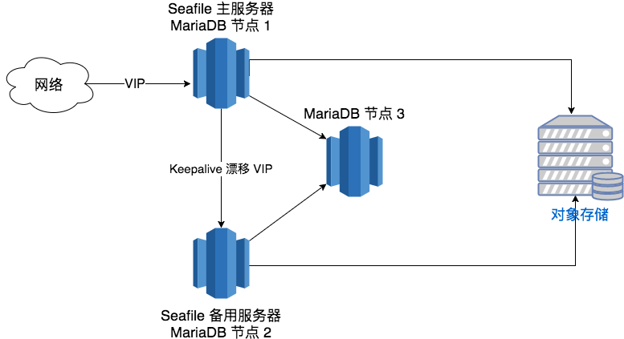

# 基本的 Seafile 高可用集群

本文档介绍用 3 台服务器构建 Seafile 高可用集群的架构。这里介绍的架构仅能实现“服务高可用”，而不能支持通过扩展更多的节点来提升服务性能。如果您需要“可扩展 + 高可用”的方案，请参考[Seafile 可扩展集群文档](deploy_in_a_cluster.md)。

在这种高可用架构中包含3个主要的系统部件：

- Seafile 服务器：提供 Seafile 服务的软件
- MariaDB 数据库集群：保存小部分的 Seafile 元数据，比如资料库所有者、共享关系等
- 文件存储后端：负责保存文件块和元数据

其中，文件存储后端可以是 NAS 或者分布式对象存储，这个存储系统本身的可用性和可靠性不在本文档的讨论范围之内，应该由第三方系统保证。所以我们在这里主要讨论如何实现 Seafile 服务器的高可用，以及 MariaDB 数据库的可用性和可靠性。

## 架构

这种3节点高可用方案的架构图如下：

MariaDB 的高可用和可靠性通过部署 3 节点的 Galera 集群保证。简单地说，Galera 集群是一个针对 MariaDB 的多主（Multi-Master）高可用方案。集群中每个 MariaDB 实例都保存数据库的一个完整副本，客户端可用通过任何一个实例读写数据。这个集群能够在一个节点掉线的情况下继续提供服务，并保证数据一致。这个方案的最大优点是所有对数据库的写入都是严格在三个节点上同步进行的，不存在数据不同步的问题。因此，Seafile 主服务器和备用服务器都只需要直接访问本地的 MariaDB 实例即可。

在正常情况下，Seafile 服务运行在 Seafile 主服务器上，对外提供 Seafile 的所有功能，包括 web 访问、文件同步、搜索、预览等。当主服务器正常工作时，备用服务器上并不运行 Seafile 服务。主备两个服务器上都运行 Keepalived 进程。它负责管理 Seafile 对外提供服务的 IP 地址（虚拟 IP 地址，简称 VIP）。当主服务器正常工作时，它把 VIP 关联在主服务器上，客户端通过主服务器访问 Seafile；当检测到主服务器宕机后，备用服务器上的 Keepalived 进程自动把 VIP 漂移到备用服务器，并自动在上面启动 Seafile 服务。这种模式保证了 Seafile 服务的高可用性。由于数据都是保存在后端存储和 MariaDB 集群中，所以在切换过程中不会出现数据丢失。

## 部署实现

以下我们把 Seafile 主服务器称为 Node1，备用服务器节点称为 Node2，第三个 MariaDB 节点称为 Node3。

### 在 Node1 Node2 上安装 Seafile

在 Node1 Node2 上用一键安装脚本安装 Seafile 的过程，在这个过程中 MariaDB 已经被安装。

### 在 Node3 上安装 MariaDB 并配置 Galera 集群

### 配置数据库备份

在每个节点上运行一个 cron 任务，每天凌晨备份一下数据库。
