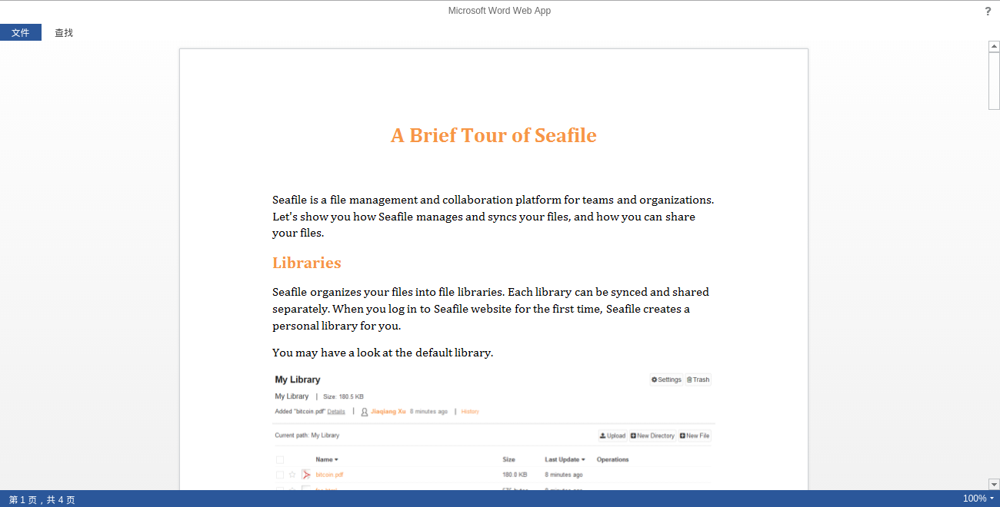

# Office Online Server 集成

在Seafile专业版 4.4.0(或更高版本)中，可以使用 Microsoft Office Online Server (以前命名为Office Web Apps)在线预览文档。 Office Online Server 为所有的 Office 文档提供最佳预览。它还支持直接在web浏览器中协作编辑Office文件。对于拥有 Microsoft Office 批量许可证的组织，可以免费使用Office Online Server。有关 Office Online Server 的更多信息以及如何部署Office Online Server，请参阅 [Microsoft's documentation](https://technet.microsoft.com/en-us/library/jj219455(v=office.16).aspx).

Seafile自身的Office文件预览仍然是默认的。使用 Office Online Server 进行预览，请添加以下配置项到 `seahub_settings.py` 中。

``` python
# Enable Office Online Server
ENABLE_OFFICE_WEB_APP = True

# Url of Office Online Server's discovery page
# The discovery page tells Seafile how to interact with Office Online Server when view file online
# You should change `http://example.office-web-app.com` to your actual Office Online Server server address
OFFICE_WEB_APP_BASE_URL = 'http://example.office-web-app.com/hosting/discovery'

# Expiration of WOPI access token
# WOPI access token is a string used by Seafile to determine the file's
# identity and permissions when use Office Online Server view it online
# And for security reason, this token should expire after a set time period
WOPI_ACCESS_TOKEN_EXPIRATION = 30 * 60 # seconds

# List of file formats that you want to view through Office Online Server
# You can change this value according to your preferences
# And of course you should make sure your Office Online Server supports to preview
# the files with the specified extensions
OFFICE_WEB_APP_FILE_EXTENSION = ('ods', 'xls', 'xlsb', 'xlsm', 'xlsx','ppsx', 'ppt',
    'pptm', 'pptx', 'doc', 'docm', 'docx')

# Enable edit files through Office Online Server
ENABLE_OFFICE_WEB_APP_EDIT = True

# types of files should be editable through Office Online Server
# Note, Office Online Server 2016 is needed for editing docx
OFFICE_WEB_APP_EDIT_FILE_EXTENSION = ('xlsx', 'pptx', 'docx')


# HTTPS authentication related (optional)

# Server certificates
# Path to a CA_BUNDLE file or directory with certificates of trusted CAs
# NOTE: If set this setting to a directory, the directory must have been processed using the c_rehash utility supplied with OpenSSL.
OFFICE_WEB_APP_SERVER_CA = '/path/to/certfile'


# Client certificates
# You can specify a single file (containing the private key and the certificate) to use as client side certificate
OFFICE_WEB_APP_CLIENT_PEM = 'path/to/client.pem'

# or you can specify these two file path to use as client side certificate
OFFICE_WEB_APP_CLIENT_CERT = 'path/to/client.cert'
OFFICE_WEB_APP_CLIENT_KEY = 'path/to/client.key'
``` 

然后重启服务

```
./seafile.sh restart
./seahub.sh restart
```

单击您在seahub_sttings.py中指定的文档后，您将看到新的预览页面。



## 故障排查

了解Web应用集成原理将帮助你排查问题。当用户访问页面时：

1. (seahub->浏览器) Seahub 将生成一个包含 iframe 的页面并将其发送到浏览器。
2. (浏览器->office web app) 使用 iframe，浏览器将尝试从 office online server 加载预览页面。
3. (office online server->seahub) office online server 接收请求并向 Seahub 发送请求以获取文件内容。
4. (office online server->浏览器) office online server 发送文件预览页面给浏览器。

请检查Seahub的Nginx日志（步骤3）和 office online server，以查看哪个步骤出错。

### 注意在 Windows 上的分页文件

您应该确保在您的Windows系统中至少配置了几GB的分页文件。否则，IIS工作进程在处理Office在线请求时可能会随机死亡。