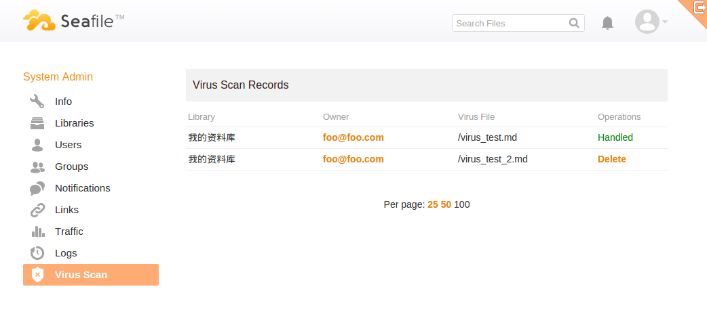

# 文件病毒扫描

**注意**：自从 Seafile 5.0.0 版本以后，所有的配置文件转移到了统一的配置文件目录 **conf** 。[详情](../deploy/new_directory_layout_5_0_0.md)

在Seafile专业版 4.4.0(及以上)版本中，Seafile可以在后台扫描上传文件中的恶意内容。配置为定期运行后，扫描程序将扫描所有现有库。此后的每次扫描中，该程序仅扫描上次扫描后新上传的或更新过的文件。对于每一个文件，该进程都执行一条用户指定的病毒扫描指令来检查文件是否是病毒。大多数反病毒程序都为 Linux 提供了命令行工具。

要启用该功能，添加以下配置项到 `seafile.conf`：

```
[virus_scan]
scan_command = (command for checking virus)
virus_code = (command exit codes when file is virus)
nonvirus_code = (command exit codes when file is not virus)
scan_interval = (scanning interval, in unit of minutes, default to 60 minutes)
```

关于选项的更多细节：

* 在 Linux/Unix，大多数病毒扫描命令针对病毒或非病毒会返回特定的退出码。更多信息请参阅反病毒程序手册。

以下提供了 ClamAV (http://www.clamav.net/) 的示例：

```
[virus_scan]
scan_command = clamscan
virus_code = 1
nonvirus_code = 0
```

要测试您的配置是否正常工作，您可以手动触发扫描：

```
cd seafile-server-latest
./pro/pro.py virus_scan
```

如果检测到病毒，则可以在管理区域的“病毒扫描”页面上查看扫描记录并删除受感染文件。


在专业版 6.0.0 之后，添加更多的选项来提供更细粒度的病毒扫描控制。

```
[virus_scan]
......
scan_size_limit = (size limit for files to be scanned)
scan_skip_ext = (a comma (',') separated list of file extensions to be ignored)
threads = (number of concurrent threads for scan, one thread for one file, default to 4)
```

文件扩展名应该以 ‘.’ 开头，扩展名不区分大小写。默认情况下，具有以下扩展名的文件将被忽略：

```
.bmp, .gif, .ico, .png, .jpg, .mp3, .mp4, .wav, .avi, .rmvb, .mkv
```

您提供的列表将覆盖默认列表。
