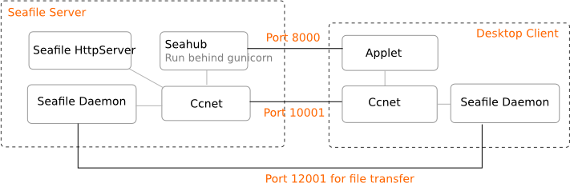
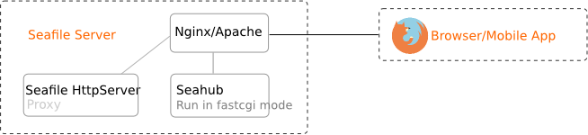

# Components of Seafile Server

Seafile server comprises of the following services.

* **Ccnet daemon** (ccnet for client side or ccnet-server for server side)：networking service daemon. In our initial design, Ccnet worked like a traffic bus. All the network traffic between client, server and internal traffic between different components would go through Ccnet. After further development we found that file transfer is improved by utilizing the Seafile daemon component directly.
* **Seafile daemon**：data service daemon
* **Seahub**：the website. Seafile server package contains a light-weight Python HTTP server `gunicorn` that serves the website. Seahub runs as an application within gunicorn.
* **FileServer**: handles raw file upload/download functions for Seahub. Due to Gunicorn being poor at handling large files, so we wrote this "FileServer" in the C programming language to serve raw file upload/download.
* **Controller**: monitors ccnet and Seafile daemons, restarts them if necessary.

**The picture below shows how Seafile desktop client syncs files with Seafile server**:

 

**The picture below shows how Seafile mobile client interacts with Seafile server**:

 

**The picture below shows how Seafile mobile client interacts with Seafile server if the server is configured behind Nginx/Apache**:

