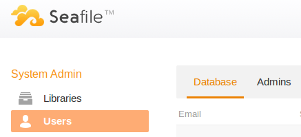

# Administration

### Enter the admin panel

As the system admin, you can enter the admin panel by click the `tools` button at the top-left, beside the avatar:

After clicking the button, you will get into the admin panel:

### Account management

* [Account management](account.md)

### Logs

* [The location of log files](logs.md)

### Backup and Recovery

Backup and recovery:

* [Backup and recovery](backup_recovery.md)

Recover corrupt files after server hard shutdown or system crash:

* [Seafile FSCK](seafile_fsck.md)

You can run Seafile GC to remove unused files:

* [Seafile GC](seafile_gc.md)
