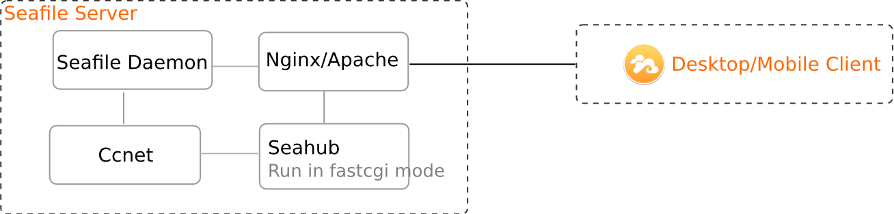

# Seafile服务器组件

## Server 4.0

从 4.0 开始，Seafile 支持 HTTP/HTTPS 同步协议，并简化了系统组件： 

- Seahub：网站界面，供用户管理自己在服务器上的数据和账户信息。Seafile服务器通过"gunicorn"（一个轻量级的Python HTTP服务器）来提供网站支持。Seahub作为gunicorn的一个应用程序来运行。
- **Seafile server** (``seaf-server``)： 数据服务进程, 处理原始文件的上传/下载/同步。
- **Ccnet server** (``ccnet-server``)： 内部 RPC 服务进程，连接多个组件。

下面这张图显示了将 Seafile 部署在 Nginx/Apache 后的架构。客户端需要在选项界面中开启 "sync over HTTP/HTTPS"。

## Server 3.x

Seafile服务器由以下组件构成

* Ccnet daemon(客户端为ccnet / 服务器端为ccnet-server)：网络服务守护进程。在我们最初的设计中，Ccnet就像一辆网络流量“公共汽车”，所有客户端和服务器之间的网络流量，以及内部组件之间的数据传输，都经由Ccnet来处理和转发。但是后来我们发现，文件传输直接由Seafile daemon组件来处理会更好。

* Seafile daemon：数据服务守护进程。

* Seahub：网站界面，供用户管理自己在服务器上的数据和账户信息。Seafile服务器通过"gunicorn"（一个轻量级的Python HTTP服务器）来提供网站支持。Seahub作为gunicorn的一个应用程序来运行。

* FileServer (3.1 版前叫 HttpServer): 处理Seahub端文件的上传与下载。由于gunicorn对大型文件的处理并不好，所以我们用C语言写了这个FileServer组件，来专门处理文件的上传与下载。

* Controller: ccnet和seafile守护进程监视器，必要时会重启守护进程。

**桌面客户端与Seafile服务器之间的文件同步过程**:

 

**移动客户端与Seafile服务器之间的交互过程**:

 

**移动客户端与Seafile服务器（基于Nginx/Apache）之间的交互过程**:

