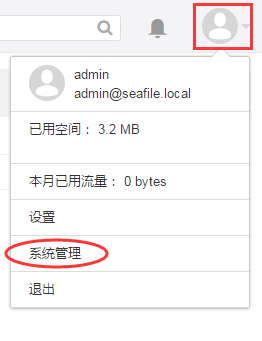
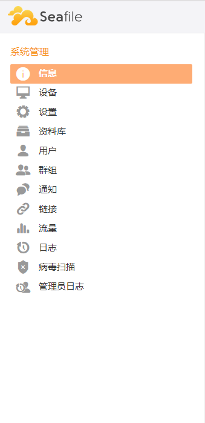
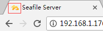

# 管理员控制面板

为了便于统一管理，Seafile 在 Web 界面提供了系统管理员控制面板。使用管理员账号登陆 Seafile Web 页面，进入“系统管理”界面，即可进行系统设置，用户管理，资料库统计，日志查询等一系列管理操作。 

## 如何进入“系统管理”页面

首先，要使用具有管理员身份的用户账号，通过浏览器登陆 Seafile Web界面；然后鼠标点击右上角头像图标，在下拉菜单栏中选择“系统管理”：



进入“系统管理”界面后，选择左侧一级导航栏中的相应条目做进一步管理配置：



### 信息

顾名思义，记录当前 Seafile 系统的基本信息。

- 系统信息：记录一些授权信息。6.1.5 Pro 及其以后版本，我们提供了 `Upload licence` 功能，这意味着在非集群模式下，可以通过Web界面直接上传授权文件以生效，无需重启Seafile服务。

- 资料库/文件：统计当前 Seafile 系统中的所有有效资料库和文件(不包括已删除到回收站中的资料库和文件)

- 已用空间：记录当前 Seafile 系统中总的已使用空间(不包括已删除到回收站中的文件占用空间)

- 所有的设备/当前连接的设备：统计所有已接入过的设备(包括桌面客户端、移动端)以及当前正在连接的设备(包括桌面客户端和移动端)

- 激活用户数/用户总数/用户数限制：记录当前已激活的用户数、当前总用户数(包括已激活和未激活)以及最大可注册用户数

- 群组：统计当前系统中创建的群组数

### 设备

记录当前系统中通过客户端工具连接Seafile服务的日志信息，包括桌面客户端和移动客户端；相应的二级菜单栏中记录了各用户通过客户端访问的详细记录，包括用户名，客户端平台/版本，设备名称，来源IP，和最近一次访问时间。以及客户端可能发生的同步错误信息记录。

### 设置

* 注意：通过 Web 界面设置的选项会保存在数据库(seahub_db/constance_config)中。他们比配置文件中的设置有更高的优先级。

#### URL

`SERVICE_URL` 和 `FILE_SERVER_ROOT` 为常用配置项，Seafile服务安装完成后可能都需要修改此项配置。当你上传下载文件失败时我们建议您首先要检查此处配置信息。

`SERVICE_URL`：服务器URL，例如`https://seafile.example.com`或者`http://192.168.1.2:8000`。如果没有配置Nginx/Apache代理，则默认需要通过8000端口访问，因此需要加上8000端口；若使用了Nginx/Apache代理，则默认通过80端口访问，无需添加任何端口信息；如果您使用了其他自定义端口，请在此处配置上自定义端口。

`FILE_SERVER_ROOT`：下载上传文件的内部URL。如果此URL错误，用户将不能下载上传文件。如果配置了Nginx/Apache代理，这个URL的值为 "SERVICE_URL/seafhttp"；否则这个URL可能为 "http://<seafile_server of ip>:8082"。

#### Logo

- Logo：在较新版本的 Seafile Pro 中，我们支持管理员通过Web界面直接上传配置服务端 Logo。

- Favicon：在较新版本的 Seafile Pro 中，我们支持管理员通过Web界面直接上传配置显示在浏览器顶端的网站图标。如下图所示：


#### 用户

- 允许用户注册：开启此项功能将开放用户注册，即用户自己可通过Web界面的登陆窗口点击注册按钮，完成注册。该功能默认关闭。

- 注册后激活：用户注册后立即激活用户，只有处于激活状态的用户才能正常访问Seafile服务；如果关闭此功能，新注册用户需要通过管理员手动激活或者激活邮件激活。该功能默认关闭。

- 发送激活邮件：用户注册完成后向注册邮箱发送激活邮件，用户可点击邮件中的激活连接激活帐号，需要在服务端配置邮件发送功能。该功能默认关闭。

#### 资料库

- 加密资料库：开启该功能将允许用户创建加密资料库，任何用户(包括管理员以及加密资料库创建者)在没有密码的情况下一概无法访问加密资料库中的任何内容。该功能默认开启。

- ENABLE_USER_CREATE_ORG_REPO：允许用户创建机构资料库，如果关闭该功能，将只有系统管理员可以创建。该功能默认开启。

- Preview File Extensions：指明在线预览文件的扩展名，扩展名之间用逗号分隔。当文件名后缀符合此处配置的扩展名列表中的任意一个，该文件将可以在web端被预览，预览时将被转换为txt格式。

#### 同步

- DISABLE_SYNC_WITH_ANY_FOLDER：如果启用此功能，桌面客户端将不能同步 Seafile 目录外的文件夹。禁用此功能，允许同步任意位置的文件夹。该功能默认关闭。

### 资料库

资料库管理界面。显示当前 Seafile 系统中所有资料库及其相关信息；您可以选择二级菜单栏中的条目，执行相应操作。

#### 全部

显示当前 Seafile 系统中所有用户创建的资料库以及各资料库的名称，大小，ID，拥有者等信息；管理员可以还将各资料库删除，移动，共享；如果在 `seahub_settings.py` 文件中配置了 `ENABLE_SYS_ADMIN_VIEW_REPO = True` 项，还将允许管理员直接访问各资料库中的内容，加密资料库依旧需要密码。

#### 系统资料库

此处将只有一个资料库 "My Library Template"；该资料库中存放的文件将作为模版文件在创建用户时添加到用户的"私人资料库"中；管理员可根据需要，上传文件到该资料库中，此后新创建用户的"私人资料库"中将默认生成这些文件。

#### 回收站

近30天内用户删除的资料库和文件可以在此处找到，管理员可以选择"还原"或者"彻底删除"。

* 提示：当处于 “全部” 或者 “回收站” 条目下时，左侧一级菜单栏最下方将出现一个搜索框，相应的可根据资料库名称或者资料库所有者快速查找某资料库。

### 用户

用户管理界面。

#### 数据库

统计所有通过seafile系统创建的用户，以及相应用户已用空间，用户创建时间和最后登陆时间；管理员还可根据实际需要管理用户的激活状态，用户角色，可用容量等；
右上角另有三个管理选项：添加用户，导入用户(批量添加用户)，导出用户到Excel。

"导入用户"文件可以使用txt文件，文件内容格式为：邮箱,密码,名字,部门,角色,容量
其中名字、部门、角色和容量(以M为单位)可选，不配置字段留空即可，每用户单独占用一行，示例如下：

```
abc@abc.com,password,张三,运维部,,10000
seafile@seafile.com,password,李四,,,,
```

#### 管理员

统计管理员用户，及其相关信息；选择右上角"添加管理员"可指定一个已有普通用户为管理员身份。

#### LDAP（需要服务端配置AD集成）

统计所有从AD系统同步过来的用户信息。

#### LDAP(已导入)（需要服务端配置AD集成）

统计所有从AD系统同步过来并已经登陆完成的用户。

### 群组

群组管理界面。记录各群组信息，右上角可新建群组，鼠标移动到某群组条目上，可显示删除或转让该群组。

点击群组名称可进入某群组内部，可查看该群组拥有的资料库，群成员等；点击"成员"按钮，右上角可选择"添加成员"将系统中已有用户添加到该群组中。鼠标移动到除群组拥有者外的其他群成员上，可选择指定其为“管理”角色，或者从群组中删除该成员。

### 通知

管理通知信息。
右上角选择"添加新通知"，鼠标移动到新添加的通知上可选择“设为当前通知”，此后seafile系统中的用户在Web界面刷新或者重新登陆都将在浏览器顶部显示该通知信息。再次移动鼠标到该通知上可选择“删除”通知。

### 链接

管理所有的共享链接，同样移动鼠标到某个链接上即可选择删除该链接。

### 流量

仅统计共享链接所使用的流量。

### 日志

记录各用户在web界面的操作，包括登录信息，文件访问，文件更新，共享权限以及邮件发送。这些信息都可以选择导出到 Excel。

### 病毒扫描（需要服务端配置病毒扫描功能）

记录每一次病毒扫描的操作明细。

### 管理员日志

记录管理员的操作信息，包括：添加/删除用户，添加/删除资料库，创建/删除群组等。


